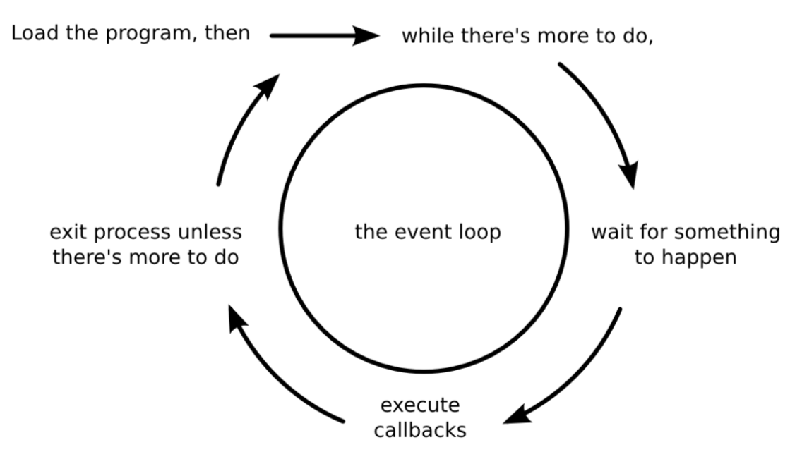
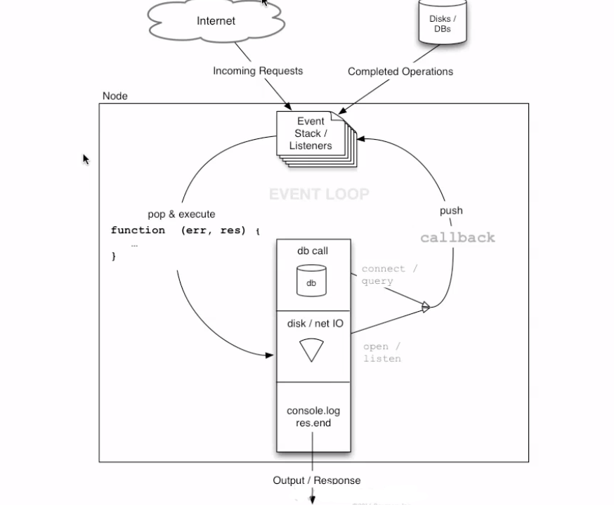

# 2. Introduction to Node

## Some Intro to Different Programming Models

* **One user, One Process Programming**
  * Traditional programming does I/O same was as it does local function calls
  * It blocks the process when doing I/O operations
  * Which didn't scale well with the widespread of computer networks and the Internet
  * Managing many processes places a big burden on the OS - in memory & context switching costs
    * As a result, the performance of these tasks starts to reduce after a certain number of processes is reached

* **Multi-threaded Programming**
  * Alternative to above model
  * When one thread is waiting on I/O operation, another thread can takeover the CPU.
  * When I/O operation finishes, the thread can wake up, which means the thread that was running can be interrupted and eventually be resumed
  * Programmers must be careful with concurrent access to the shared memory state by multiple threads
  * Have to use synchronization primitives like locks and semaphores to synchronize access to some data structures
  * **If the application relies heavily on a shared state threads, this type of programming can easily lead to strange bugs and difficult to debug**

## **Event-Driven Programming**
* Flow of execution is determined by the events
* Events are handled by event handlers or event callbacks
* **Event Callback** is a function that is invoked when something significant happens like
  * when a user clicks on a button
  * when the result of a DB query is available
  * when the response to external request is available

* In typical blocking I/O Programming (below), current thread or process wait until the database layer finishes processing it
```
res = query('SELECT * FROM USERS WHERE USER_ID = 100');
doSomethingWith(res);
```
* In Asynchronous Programming
```
queryFinished = function(res) {
    doSomethingWith(res);
}
query('SELECT * FROM USERS WHERE USER_ID = 100',queryFinished);
```

* The style of programming - whereby instead of using a return value, we define functions that are called by the system when interesting events occur is called ***event-driven or asynchronous programming***

* This is one of the defining features of Node

* Current process will not block when it is doing I/O. Hence, several I/O operations can occur parallel and each respective callback will be invoked when operation finishes.

### Event Loop

* Event-Driven programming style is accompanied by an event loop

* construct that mainly performs two functions in a continuous loop
  1. event detection
  2. event handler triggering

* Event Loop is just one thread running inside one process

* Simple visual representation of event loop


* Event loop representation with more details



* **Event-Driven programming is the best way to create a service that can handle many concurrent connections**

* This is more efficient reg memory as less context to store and more efficient req time as less context switching

* *JavaScript has closures and first-class functions, which makes a powerful match for event-driven programming*

### Closures
* Closures are functions that inherit variables from their enclosing environment

* This powerful feature is at the heart of Node's success

* In JavaScript, functions are first-class objects - which means we can pass functions as arguments to other functions

* In JavaScript, a function operates not by working in isolation but by remembering the context where it was declared, which enables manipulation of any variable present in that or ay parent context

* Closure pattern helps us in doing event-driven programming without having to maintain the state by passing it around to functions. JavaScript Closure keeps the state for us.


<br>
<br>

## Good to know and understand topics/key words


**Thread**
  * Thread is a kind of light-weight process that shares memory with every other thread within the same process


**CPU-bound activities**
* CPU-bound activities are tasks that primarily consume CPU time during execution. In general, these tasks are computationally heavy algorithms operating on in-memory data. In terms of a web applications, this applies to tasks such as input validation, template rendering or on-the-fly encoding/decoding of content.

**I/O-bound activities**
* I/O-bound activities are tasks mainly limited by I/O resources, such as network I/O or file I/O. I/O-bound activities often take place when tasks operates on external data that is not (yet) part of its own memory. In case of our architectural model, this includes access to most platform components, including storage backends, background services and external services.

## Further Reading Links
* https://www.journaldev.com/7462/node-js-architecture-single-threaded-event-loop
* https://www.youtube.com/watch?v=8aGhZQkoFbQ
